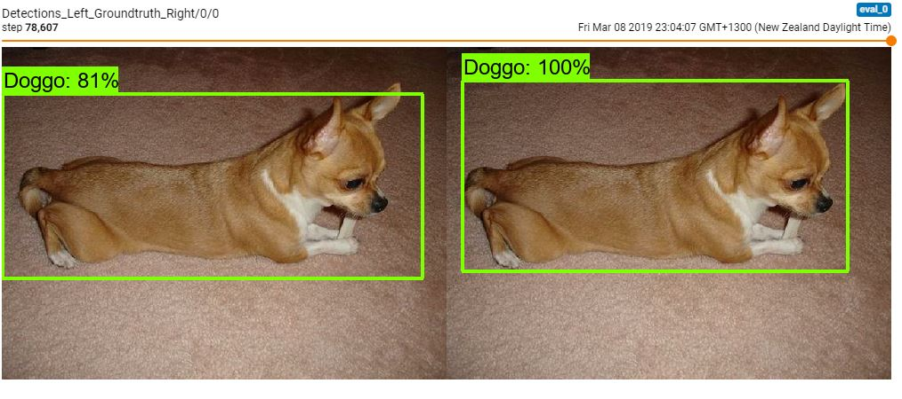

# Doggo-Recognizer
A project to train a neural network to recognize a dog given an input image. I trained this using resnet 50 v1 fpn, tensorflow and the stanford dogs dataset at 100,000 steps. This step is the first part of a dog breed recognizer project which I am currently doing.
This model is currently training here's an image of it at 78,000 steps.

